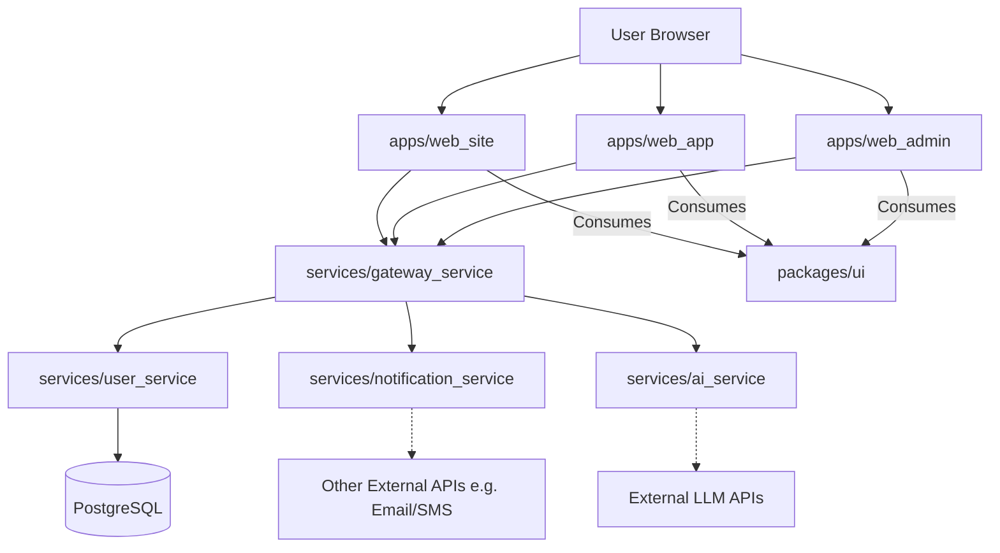

# System Patterns: my-scaffold-project

## System Architecture
The project employs a monorepo architecture housing multiple, independent frontend applications and a suite of backend microservices. Communication between frontends and backends, and between backend services themselves, is primarily API-driven (RESTful HTTP requests), orchestrated by an API Gateway.

- **Monorepo:** A single pnpm workspace containing all applications and services.
- **Frontend Applications (`apps/*`):** Each is a standalone Single Page Application (SPA) built with React/TypeScript/Vite.
- **Shared UI Library (`packages/ui`):** A dedicated package for reusable UI components consumed by frontend applications.
- **Backend Services (`services/*`):** Each is an independent FastAPI application, containerized via Docker.
- **API Gateway (`services/gateway_service`):** The central entry point for all client requests, handling authentication and routing to other backend services.
- **Database (`PostgreSQL`):** A central database instance, primarily for `user_service` but accessible by other services if needed.
- **Containerization (`Docker`):** All backend services and the database are containerized. Frontend apps can be containerized for consistent builds/serving.
- **Local Orchestration (`Docker Compose`):** Manages all services for local development.

## Key Technical Decisions
- **Monorepo for Cohesion:** Facilitates code sharing (especially UI), atomic commits for cross-cutting changes, and consistent tooling.
- **Microservices for Backend Scalability & Separation:** Allows backend services to be developed, deployed (conceptually), and scaled independently.
- **FastAPI for Python Backend Performance & DX:** Chosen for its speed, modern Python features (type hints), and automatic API documentation.
- **React with TypeScript for Frontend Robustness:** Provides strong typing and a rich component model for building complex UIs.
- **Vite for Frontend Build Speed:** Offers a fast development experience and optimized builds.
- **Tailwind CSS for Utility-First Styling:** Enables rapid UI development without pre-defined component styles.
- **shadcn/ui for Controlled Components:** Provides well-designed, accessible components that are copied into the project for full ownership and customization.
- **API Gateway Pattern:** Centralizes cross-cutting concerns like auth, rate limiting, and request routing.
- **i18n from the Start:** Ensures frontend applications are translation-ready by using i18n keys for all UI text.

## Design Patterns in Use
- **Monorepo Pattern:** Manages multiple projects within a single repository.
- **Microservice Architecture Pattern:** Decomposes the backend into small, independent services.
- **API Gateway Pattern:** Provides a single, unified entry point for backend services.
- **Service-Oriented Architecture (SOA):** (Implicit) Services provide distinct business functionalities through well-defined interfaces.
- **Repository Pattern (for Database Interaction):** (To be implemented within services like `user_service`) Abstracts data persistence logic.
- **Dependency Injection:** Heavily used by FastAPI to manage dependencies and for features like authentication and authorization.
- **Model-View-Controller (MVC) / Model-View-ViewModel (MVVM) variants:** (Implicit in frontend React applications) Separation of concerns for UI, data, and logic.
- **Utility-First CSS (Tailwind CSS).**

## Component Relationships

- **Frontend to Gateway:** Frontend applications make API calls exclusively to the `gateway_service`.
- **Gateway to Backend Services:** The `gateway_service` routes these calls to the appropriate internal service (`user_service`, `notification_service`, `ai_service`).
- **Internal Service Communication:** Direct service-to-service communication is possible but should be minimized; prefer routing through the gateway if the interaction involves external concerns or complex orchestration logic not specific to a single service.
- **Database Access:** `user_service` directly accesses PostgreSQL. Other services could access it if necessary, but data ownership should be clear.
- **Shared UI:** All frontend applications import and use components from `packages/ui`.

## Critical Implementation Paths
- **Authentication Flow:** User logs in via `web_app` or `web_admin` -> `gateway_service` authenticates -> `user_service` verifies credentials & issues token (or gateway does via user_service primitives) -> token stored in frontend -> subsequent requests include token for `gateway_service` validation.
- **User Registration:** New user signs up -> `gateway_service` -> `user_service` (creates user in DB) -> `notification_service` (sends welcome email).
- **AI Feature Usage:** Frontend requests AI feature -> `gateway_service` -> `ai_service` -> External LLM API -> `ai_service` processes response -> `gateway_service` -> Frontend.
- **Initial Project Setup:** Cloning, running `pnpm install`, and `docker-compose up -d` should bring up the entire local development environment. 